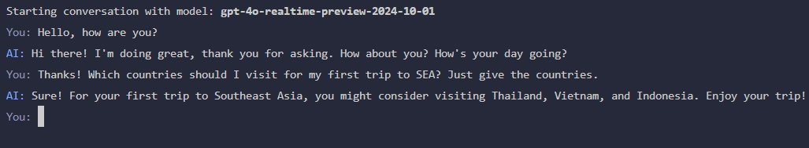

# Real-Time Audio and Text Conversation with OpenAI GPT-4 Realtime

This example showcases how to build a real-time audio and text conversation system using OpenAI's GPT-4o Realtime API. The application processes audio and text responses from OpenAI, plays audio and displays transcripts in the console.

Users can interact with the system by sending continuous messages through the command-line interface (CLI).



The audio will be played on the system's default audio output device. The text transcript will be displayed in the console.

## Audio playback

To enable the audio playback, you have to add the `audio` feature to default features in the `Cargo.toml` file:

```toml
default = ["audio"]
audio = ["hound", "rodio"]
```

To disable audio playback, you can remove the `audio` feature from the default features in the `Cargo.toml` file.
